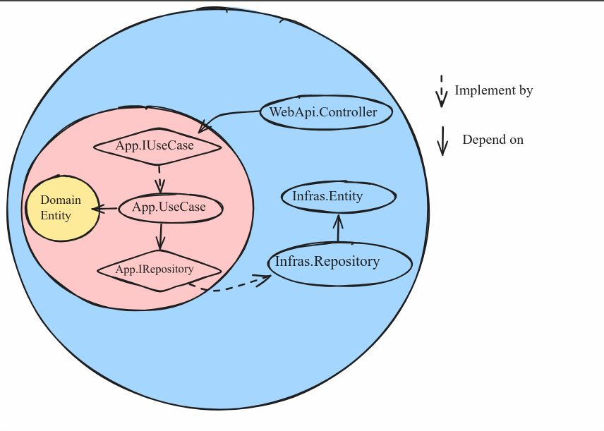

# DOCUMENT FOR DEVELOPER

## Short Description
### About 

### Technology
- ASP.NET core
- SvelteKit

### Why I choose SvelteKit
- Easy to learn 
- Fast and small bundle
- I want to learn Svelte

## Architecture
 

## Project structure
- [IPM.Domain](#ipmdomain)
- [IPM.Application](#ipmapplication)
- [IPM.Infrastructure](#ipminfrastructure) 
- [IPM.ClientApp](#ipmclientapp) 
- [IPM.WebApi](#ipmwebapi) 

### IPM.Domain
```txt
IPM.Domain/
   |__ <DomainEntity>.cs
```
This folder contains domain entities

### IPM.Application
```txt
IPM.Application/
   |___ Common/
   |___ IRepositories/
   |___ IServices/
   |___ UseCases/
```

### IPM.Infrastructure
```txt
IPM.Infrastructure/
   |___ EntityFrameworkDataAccess/
   |   |___ Config/
   |   |___ Entities/
   |   |___ Repositories/
   |   |_ AppDBContext.cs
   |   |_ NpgsqlConnectStringBuilder.cs
   |
   |___ Migrations/
```

### IPM.ClientApp
```txt
IPM.ClientApp/
   |___ (SvelteKit App)
```

### IPM.WebApi
